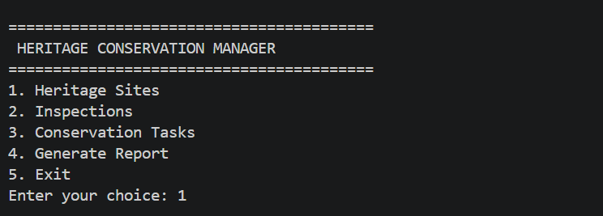
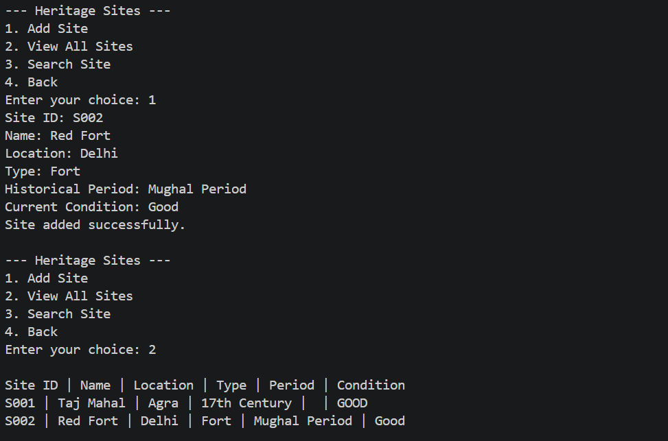
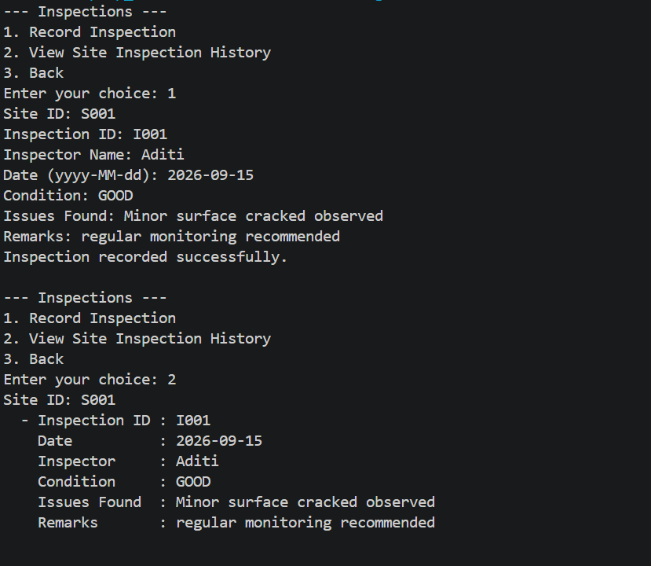
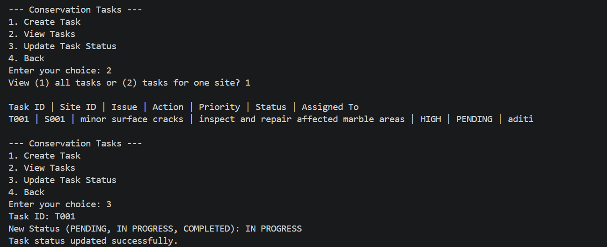

# Heritage Conservation Manager

## 1. Project Overview

The Heritage Conservation Manager is a Java-based console application designed to organize and manage information related to heritage sites and their conservation activities.

The application allows users to register heritage sites,record inspections, track conservation tasks, and generate text-based reports. The project uses MySQL as the database and JDBC for communication between the Java application and the database.

The project demonstrates core Java programming concepts including Object-Oriented Programming, Collections, Exception Handling, File I/O, and JDBC database connectivity.

---

## 2. Features

### Heritage Site Management

- Add a new heritage site.
- View all registered heritage sites.
- Search for a heritage site using its Site ID.
- Store site name, location, type, historical period, and current condition.

### Inspection Management

- Record inspections for registered heritage sites.
- Store inspector name, inspection date, condition, issues found, and remarks.
- View the complete inspection history of a selected site.

### Conservation Task Management

- Create conservation tasks for identified issues.
- View existing conservation tasks.
- Assign priority to tasks.
- Assign tasks to conservation staff.
- Update task status.

Supported task statuses:

- PENDING
- IN PROGRESS
- COMPLETED

Supported priorities:

- LOW
- MEDIUM
- HIGH

### Report Generation

- Generate a text report for a selected heritage site.
- Include site information, inspection history, and conservation tasks.
- Save reports as .txt files in the reports folder.

### Database Management

- MySQL is used for persistent data storage.
- JDBC is used to establish database connectivity.
- DAO classes handle database operations.
- Prepared statements are used for SQL operations.

---

## 3. Technologies and Tools Used

- Java
- JDK 21
- MySQL 8
- JDBC
- MySQL Connector/J
- Visual Studio Code
- MySQL Workbench
- Git and GitHub

---
## 4. Project Structure

The project is organized as follows:

```bash
HeritageConservationManager/
├── .vscode/
│   └── settings.json
├── out/
├── reports/
├── sql/
│   └── schema.sql
├── src/
│   ├── dao/
│   │   ├── ConservationTaskDAO.java
│   │   ├── HeritageSiteDAO.java
│   │   └── InspectionDAO.java
│   ├── exception/
│   │   ├── InvalidDataException.java
│   │   └── SiteNotFoundException.java
│   ├── model/
│   │   ├── ConservationTask.java
│   │   ├── Conservator.java
│   │   ├── HeritageSite.java
│   │   ├── Inspection.java
│   │   ├── Inspector.java
│   │   ├── Reportable.java
│   │   └── Staff.java
│   ├── util/
│   │   ├── DatabaseConnection.java
│   │   └── ReportGenerator.java
│   └── Main.java
├── .gitignore
├── README.md
└── statement.mdHeritageConservationManager/
├── .vscode/
│   └── settings.json
├── out/
├── reports/
├── sql/
│   └── schema.sql
├── src/
│   ├── dao/
│   │   ├── ConservationTaskDAO.java
│   │   ├── HeritageSiteDAO.java
│   │   └── InspectionDAO.java
│   ├── exception/
│   │   ├── InvalidDataException.java
│   │   └── SiteNotFoundException.java
│   ├── model/
│   │   ├── ConservationTask.java
│   │   ├── Conservator.java
│   │   ├── HeritageSite.java
│   │   ├── Inspection.java
│   │   ├── Inspector.java
│   │   ├── Reportable.java
│   │   └── Staff.java
│   ├── util/
│   │   ├── DatabaseConnection.java
│   │   └── ReportGenerator.java
│   └── Main.java
├── .gitignore
├── README.md
└── statement.md
```

## 5. Java Concepts Demonstrated

### Object-Oriented Programming

The project demonstrates:

- Encapsulation
- Abstraction
- Inheritance
- Polymorphism
- Interfaces

The Staff class is an abstract class with Inspector and Conservator as derived classes.

The Reportable interface is implemented by domain classes that can generate report text.

### Collections

The project uses Java Collections including:

- HashMap for in-memory site lookup.
- ArrayList for inspection and conservation task records.

### Exception Handling

The project includes custom exceptions for invalid application data and missing heritage sites.

Database-related exceptions such as SQLException are handled in the database layer.

### File I/O

Generated heritage conservation reports are stored as text files using Java file handling.

### JDBC

The project uses JDBC components such as:

- Connection
- PreparedStatement
- ResultSet

The DAO layer performs database operations through JDBC.

---

## 6. Database

The project uses a MySQL database named:

heritage_conservation

The database contains three main tables:

- heritage_sites
- inspections
- conservation_tasks

The database schema is provided in:
```
sql/schema.sql
```
A heritage site can have multiple inspections and multiple conservation tasks.

---

## 7. Installation and Setup

### Prerequisites

Install the following:

1. JDK 21
2. MySQL Server 8
3. MySQL Workbench
4. Visual Studio Code
5. MySQL Connector/J

### Step 1 — Clone the Repository

Clone the GitHub repository to your computer.

### Step 2 — Open the Project

Open the HeritageConservationManager folder in Visual Studio Code.

### Step 3 — Create the Database

Open MySQL Workbench and execute:
```
sql/schema.sql
```

This creates the required database and tables.

## Step 4 — Configure Database Connection

Open:

```text
src/util/DatabaseConnection.java
```

### Step 5 — Add MySQL Connector/J

Make sure the MySQL Connector/J .jar file is available to the Java project classpath.

### Step 6 — Run the Application

Run:
```
src/Main.java
```
The application starts in the terminal with the main menu.

---

## 8. Testing Instructions

The following operations can be used to test the application.

### Test 1 — Add Heritage Site

1. Select Heritage Sites.
2. Select Add Site.
3. Enter the required site information.
4. Confirm that the application reports successful insertion.

### Test 2 — View All Sites

1. Select Heritage Sites.
2. Select View All Sites.
3. Verify that stored sites are displayed.

### Test 3 — Search Site

1. Select Heritage Sites.
2. Select Search Site.
3. Enter an existing Site ID.
4. Verify that the corresponding site is displayed.

### Test 4 — Record Inspection

1. Select Inspections.
2. Select Record Inspection.
3. Enter inspection details.
4. Confirm that the inspection is stored.

### Test 5 — View Inspection History

1. Select View Site Inspection History.
2. Enter a Site ID.
3. Verify that inspection records are displayed in descending date order.

### Test 6 — Conservation Tasks

1. Open Conservation Tasks.
2. Create a task for an existing site.
3. View the task.
4. Update its status.
5. Verify the updated status.

### Test 7 — Generate Report
1. Select Generate Report.
2. Enter a valid Site ID.
3. Verify that a .txt report is created in the reports folder.
4. Open the generated report and verify its contents.

### Test 8 — Database Persistence

1. Add data to the application.
2. Exit the application.
3. Start the application again.
4. View the stored data.
5. Confirm that the records remain available.

---


## 9. Screenshots

Screenshots demonstrating the application's execution and database operations can be added here.

Recommended screenshots include:

- Main application menu
  
- Heritage site added successfully
- View all heritage sites
   
- Inspection record
  
- Conservation task
  

